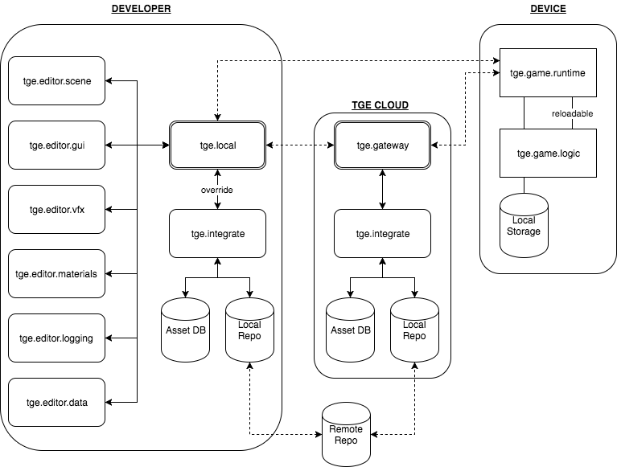

# tge - that game engine

TGE is a cross-platform 3D game engine designed with love and years of experience.

It's main purpose is to support game development in the real world, where prototyping is not enough, where teams are sometimes large and distributed around the world, and where time equals money.

With this in mind, TGE's design pillars are as follows:
1. **Made to ship**. No half-baked, undocumented features.
2. **Divide and conquer**. Everything is distributed.
3. **Performance matters**. Every second counts for players and developers alike.

TGE is, and will always be, **Open Source** and **Royalty-Free**. For everyone. Making a fun and successful game is hard enough, no need to add more difficulties.

## Architecture Overview

### Observations

- New developers shouldn't lose a day setting up their environment
- Remote developers shouldn't have to download and import *everything* to contribute to the game
- Simulators, emulators are the wrong solution to a real problem: iteration speed
- Games are online services, maintained and improved over time

TGE's high-level architecture diagram:

### Distributed Architecture

Monolithic applications are difficult to maintain and do not scale. This is why TGE is a distributed set of smaller applications communicating over network.

Game editors as stateless microservices allow anyone, with little to no setup required, to contribute to the game.

- Game programmers can push their changes to a feature branch and test it on device without having to download or build any art assets
- Programmers can merge feature branches to make pre-built game logic available to everyone
- Artists can iterate on assets (models, animations, textures, materials, etc.) and see the results in-game on multiple platforms
- Game designers can use their tools of choice to create levels, data tables, and balance the game
- QA can always test the latest build and create reports using QA-specific tools

When offline, anyone can run the full pipeline locally.

### Native Performance

C++ is TGE's client-side programming language, for both runtime and game logic layers. We're embracing the latest C++ standard supported by modern compilers.

- Every platform supports C++ for development
- C++ is a popular programming language (3rd most popular after Java and C, according to [Tiobe](https://www.tiobe.com/tiobe-index/), July 2017)
- It gives us better control over memory management
- It gives us more predictable performance
- The benefits of managed languages (like C#, Java, Python, Lua, etc.) are often not applicable in game development
- "Recent" additions to the C++ language make it more powerful and approachable:
  - Type inference
  - Lambda functions
  - Constant expressions
  - *the list goes on...*

## Middleware

- [CMake 3.9](https://cmake.org/cmake/help/v3.9/release/3.9.html) To build code and generate solutions on XCode and Visual Studio.
- [FlatBuffers](https://google.github.io/flatbuffers/index.html) For serialization.
- [ZeroMQ](http://zeromq.org/) For networking.
